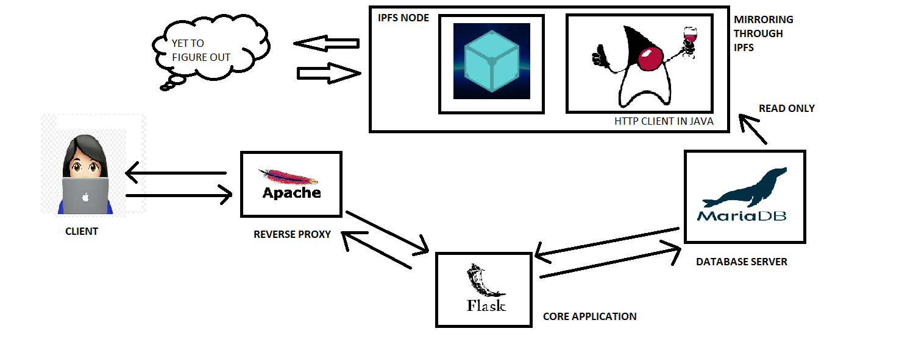

# Project Index
<!-- TOC -->
- [All About This Project](#allabouttheproject)
    - [Abstract](#abstract)
    - [Problem Definition ](#problem-definition)
    - [Objective](#objective)
    - [Scope](#Scope)
    - [Existing Systems](#existing-systems)
    - [Technology Stack](#technology-stack)
    - [Architecture](#architecture)
    - [Benifits To Society](#benifits-to-society)
    - [Why Even Build This?](#why-even-build-this)
 
<!-- /TOC -->

## Abstract 

 To build a fault tolerant (well what is the harm in calling it one), 
 decentralized micro-blogging platform to express the fundamental human right i.e. Free Speech .
 Traditional "Social Media" platforms, were never designed to   keep their user's opinions at priority. 
 The gate-keepers are generally happy as long as they have a huge growing number of daily active users.
 They seldom care about what happens to the user's content and usually turn away when matters concerning privacy or goverment interference come to limelight.
 We on the other hand, kind of are not happy with the way things are happening, 
 so we thought of a way were in we can bring about newer people respecting technologies onto the pre-existing ones.

We just intend to to be a twig and hope others help us build the nest.

## Problem Definition 

 [Decentralization,Content Deletion,Content Archival, Content Censhorship]  
 By todays web standard, that is the web 2.0 , there really existis no decentralization in reality.Everything is governed by a central authority, which then plays the monopoly.
 Our project aims to tackle this problem through a releatively new technology knows as IPFS. 

## Objective

 To provide our users a platform where they can truly express themselves without the underlying fear of being monitered, profiled and we try our level best to prevent our user's thoughts from being censored.

## Scope
 To understand the inner working of IPFS and (design+incorporate) decentralized software system design patterns to existing legacy system architectures.
 To gain insits on fault taulorent systems and data redundancy techniques specifically.
 We intend to implement a working model of the core application as soon as possible and then start working on the IPFS part, for that is our main intend.

## Existing Systems
 As IPFS is a relatively new technology, there aren't many production ready applications/services out there.
 Some (Quanta) services do exist, but those are purely built on ipfs as a their main storage component.
 Whereas , our project is a good example as to how one can incorporate IPFS on traditionally architected platforms/services.

## Technology Stack
 [Newer components may or may not be added.]

 * Apache     -->  As our main reverse proxy
 * Flask      -->  As the backend api component handler
 * SQLAlchemy -->  As the Object Relational Mapper tool
 * MariaDB    -->  As the database 
 * Java SE    -->  As the Http Client for the IPFS node
 * IPFS Node  -->  The IPFS Daemon itself 

## Benifits To Society

 A more liberal internet (as it should be ).
 A platform which truly empowers its users to be more authentic and not refrain from expressing themselves.
 Our platform would ensure that our voice and opinions stay heard well beyond time and not be muffled by factors in time.

## Architecture

 Here is a rough architecture of our platfrom that we whipped up using Microsoft Paint. Yeah we professionals.
 This project was  designed in a way to keep the ipfs implementation part isolated from the core application itself.
 Firstly, we were not so well versed in ipfs to begin with and thought lets keep it for the later part (traits of a pro coder team).
   
 
   

## Why Even Build This?

 Yes, a very valid question you all should ask.
 Well, my college had this one project as an academic requirement...
 Our team had other plans ,
 but then that would be kinda really hard to finish in the given time frame with all the other academic and non - academic work we had gotten ourselves into . 
   
 Yes , this project is open source but has been fundamentally buit by us three folks :- 
  
 1) Arun Mathai (arunmathaisk.in)
 2) Soham Kulkarni
 3) Komal Chitnis 

